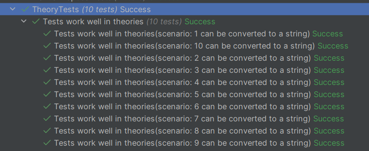

# Theories

The DSL supports the theory pattern via a
[name property](xref:BunsenBurner.TestBuilder`1.Name*).

This will become the `ToString` value and be displayed in the test runner.

[!code-csharp[Example1](../../BunsenBurner.Tests/TheoryTests.cs#TheoryExample)]

